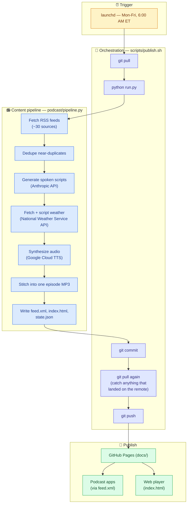

# Personalized News Podcast

A daily audio news briefing, generated automatically and published as a
real RSS podcast feed. **Status: live and running** — publishes itself
every weekday morning via a scheduled job on the author's Mac, no manual
steps required.

Subscribe by pasting the feed URL directly into any podcast app (Pocket
Casts, Apple Podcasts, Overcast, etc.):

```
https://ellewiz.github.io/personalized-news-podcast/feed.xml
```

For anyone who doesn't want to deal with a podcast app, there's also a
plain web player with no app or account required — just open the link and
press play:

```
https://ellewiz.github.io/personalized-news-podcast/
```

## What it actually does

Every weekday morning, without anyone touching a keyboard:

1. Pulls fresh items from a set of RSS feeds (general news, plus New Jersey
   Politics, Markets, Tech & AI, Soccer/World Cup, NFL, NWSL, and WNBA)
2. Dedupes near-identical coverage of the same story
3. Writes a spoken script per segment via the Anthropic API
4. Synthesizes each segment as audio via Google Cloud Text-to-Speech, with
   a different voice per category
5. Stitches the segments into one MP3, with a short pause between each
6. Publishes the new episode + updated RSS feed to GitHub Pages
7. Commits and pushes the result back to this repo

## Content structure

Two tiers per episode:

### Tier 1 — Brief awareness (target: well under a minute)

- Pulled from nine general-news feeds (PBS NewsHour, UPI Top News, BBC
  World News, NBC News, Vox World, France 24, Radio Free Europe/Radio
  Liberty, ProPublica, The Atlantic Politics — see
  [`feeds.yaml`](./feeds.yaml))
- A handful of sentences covering the top headlines
- Goal: "aware, not drowning" — never stacks multiple articles about the
  same single story

### Tier 2 — Deep dive (the bulk of the episode)

Segment order, straight after Tier 1: **New Jersey Politics**, **Markets**,
**Tech & AI**, then all sports grouped together — **Soccer/World Cup, NFL,
NWSL, WNBA**.

- Each category pulls from its own feed(s) (see [`feeds.yaml`](./feeds.yaml))
- Depth scales with how much actually happened — a quiet window for a
  given category gets a one-line mention instead of padded filler, so
  episode length flexes naturally rather than targeting a fixed runtime
  (episodes so far have run anywhere from ~2 to ~8 minutes)
- **Markets is the one exception**: capped at the 2-3 biggest stories
  regardless of volume, rather than scaling with how much happened (see
  `CATEGORY_PREFERENCES` in `podcast/pipeline.py`)
- **NFL** is steered toward Philadelphia Eagles headlines specifically and
  told to skip betting lines/odds entirely — same mechanism, different
  category (also in `CATEGORY_PREFERENCES`)
- Single narrator throughout (no two-host conversational format), but each
  category has its own distinct voice

### Weather — closing sign-off

Local TV newscast convention: weather comes last, after the sports. Pulls
today's forecast from the **National Weather Service API**
(`api.weather.gov`) — free, no signup, no API key, official U.S.
government data — for Skillman, NJ 08558 by default (configurable via
`WEATHER_LAT`/`WEATHER_LON`/`WEATHER_LOCATION_LABEL` in `.env`). If the
weather API is unavailable, the segment is skipped rather than failing the
whole episode.

## How it works



## Architecture

```
feeds.yaml                RSS sources per tier/category
config/voices.yaml         Google Cloud TTS voice per tier/category
podcast/
  config.py                env vars + config file loading
  models.py                 FeedItem / ScriptSegment dataclasses
  fetch.py                   pull + recency-filter each feed
  dedupe.py                   collapse near-duplicate stories (title similarity)
  script.py                    build spoken scripts via the Anthropic API
  pronunciation.py               word -> spoken-alias / spell-out overrides for TTS
  weather.py                      National Weather Service API (closing segment)
  tts.py                          Google Cloud TTS synthesis + plain-byte MP3
                                   concatenation (see "Why not ffmpeg" below)
  rss_feed.py                    rebuild docs/feed.xml from state/state.json
  web_player.py                   rebuild docs/index.html, a no-app-required player
  pipeline.py                     orchestrates the full run, with progress logging
run.py                      entrypoint: `python run.py`
scripts/publish.sh           run pipeline, then git add/commit/push docs + state
launchd/                     macOS scheduled-job definition (Mon-Fri, 6am ET)
state/state.json             seen item guids + published episode metadata
docs/                        GitHub Pages root: feed.xml + episodes/*.mp3
                              (each episode also gets a *-script.md transcript,
                              not published prominently but kept in the repo)
docs/artwork.png             static podcast cover art (see design notes)
```

## Setup (from scratch on a new machine)

1. `python3 -m venv .venv && source .venv/bin/activate && pip install -r requirements.txt`
2. Copy `.env.example` to `.env` and fill in:
   - `ANTHROPIC_API_KEY` — https://console.anthropic.com/settings/keys
     (requires prepaid credits, no free tier; a few dollars covers a long
     time at this usage level)
   - `GOOGLE_TTS_API_KEY` — Google Cloud Console → enable "Cloud
     Text-to-Speech API" → Credentials → **+ Create credentials → API
     key** (not the service-account wizard). Free up to 1M characters/month.
   - `PODCAST_BASE_URL` — the GitHub Pages URL this repo will be served
     from, e.g. `https://<you>.github.io/<repo>`
3. `config/voices.yaml` already has a distinct Google Neural2 voice
   assigned per tier/category — swap any of them for a different one from
   the [voice list](https://cloud.google.com/text-to-speech/docs/voices)
   if you want a different sound.
4. In GitHub repo settings → **Pages** → Source: Deploy from a branch →
   branch `main`, folder `/docs` → Save.

## Running manually

```
source .venv/bin/activate
set -a && source .env && set +a
python run.py
```

Prints progress as it goes (fetching → scripts → TTS → stitching →
publishing). Writes `docs/episodes/<date>.mp3` and rebuilds
`docs/feed.xml`, but does **not** commit or push — that's what
`scripts/publish.sh` is for.

## Automation (the actual Mon-Fri schedule)

Runs via `launchd` on macOS — the plist is checked into
[`launchd/com.ellewiz.personalized-news-podcast.plist`](./launchd/com.ellewiz.personalized-news-podcast.plist),
fires weekdays at 6:00 AM **Eastern** (the plist's `Hour: 6` fires
according to the Mac's own system timezone, currently ET — if this ever
runs on a machine in a different timezone, the actual local fire time
changes with it, the plist itself has no explicit "ET" concept).

**Install on a Mac:**
```
mkdir -p logs
cp launchd/com.ellewiz.personalized-news-podcast.plist ~/Library/LaunchAgents/
launchctl bootstrap gui/$(id -u) ~/Library/LaunchAgents/com.ellewiz.personalized-news-podcast.plist
```

**Test-fire it immediately** (don't wait for 6am ET to check it works):
```
launchctl start com.ellewiz.personalized-news-podcast
cat logs/publish.log
cat logs/publish.error.log
```

**Requirements for unattended runs to actually succeed:**
- The Mac needs to be awake at 6am ET, or it runs whenever it next wakes.
  System Settings → Battery → Power Adapter → enable "Prevent automatic
  sleeping when the display is off" — the display can still turn off on
  its own schedule, the system just stays awake underneath it.
- The first `git push` will trigger a macOS keychain prompt for
  `git-credential-osxkeychain` — click **Always Allow**, not just Allow,
  or every future unattended run will hang waiting on a prompt nobody's
  there to click.

**To change the schedule:** edit the `Hour`/`Minute`/`Weekday` values in
the plist, then re-run the `bootout` + `bootstrap` commands below to
reload it:
```
launchctl bootout gui/$(id -u)/com.ellewiz.personalized-news-podcast
launchctl bootstrap gui/$(id -u) ~/Library/LaunchAgents/com.ellewiz.personalized-news-podcast.plist
```

## Design notes and lessons learned

**Why not ffmpeg for stitching segments together.** The original design
used `ffmpeg` via `subprocess` to concatenate segment MP3s. On the actual
deployment machine (Apple Silicon Mac, macOS 26), this reliably segfaulted
— first the whole Python interpreter, then just the ffmpeg child process,
across multiple different ffmpeg invocations. Root cause: macOS's Network
and media frameworks are unsafe to use after `fork()` in a process that's
already made HTTPS calls on other threads (which this process always has,
via the Anthropic and Google TTS API calls) — a documented class of bug,
not specific to this pipeline. Rather than keep patching around it, the
fix was to drop ffmpeg entirely: Google Cloud TTS returns each segment as
a plain MP3 frame stream with no container-level metadata, so raw byte
concatenation of the files (`tts.concatenate_mp3s`) plays back correctly
with no subprocess involved. One less dependency, and no crash surface.

**Why Google Cloud TTS over ElevenLabs.** ElevenLabs sounds noticeably
more natural, but costs money from the first minute of real use. Google's
Neural2 voices are free up to 1M characters/month — comfortably covers a
five-day-a-week cadence at this episode length — at the cost of
occasionally awkward sentence breaks. If voice quality becomes the
limiting factor, swapping providers is a contained change (`tts.py` +
`config/voices.yaml` only — see git history for the ElevenLabs → Google
swap as a template for doing it the other direction).

**`dedupe.py`** uses a simple title-similarity heuristic (`difflib`, no
LLM call) to collapse near-duplicate stories. Intentionally simple; may
need tuning if it turns out to be too aggressive or not aggressive enough
in practice.

**Mispronounced words.** Google's TTS gets some words wrong (e.g. read
"Kyiv" as "Keev" — technically correct, but unrecognizable out of
context). Fix: add an entry to the `PRONUNCIATIONS` dict in
`podcast/pronunciation.py` — `"Kyiv": "Kee-ev"` means "whenever this word
appears, say it like this instead." For acronyms that get read as a word
instead of spelled out (e.g. "AI" read as "eye"), add the bare word to
the `SPELL_OUT` set instead — that uses SSML's character-by-character
mode rather than a text substitution. No other changes needed either way.

**Broadcast-time grounding.** Early episodes sometimes parroted a source
article's own time-of-day language ("this morning," "good evening")
verbatim, or blurred together events from different time zones (e.g.
implying an Asian market session was concurrent with a US session that
hadn't opened yet) — because the script prompts had no idea what time the
episode was actually being generated for. Fixed by computing the actual
broadcast time (Eastern, DST-aware) once per run in `pipeline.py` and
passing it into every Tier 1/Tier 2 prompt, with explicit rules against
copying stale time framing or inventing greetings. The Markets category
also got an explicit instruction to call out which market session an item
refers to, since it airs before the US market even opens.

**Script transcripts.** Every run writes
`docs/episodes/<date>-script.md` — the full generated text for every
segment, plus the broadcast time used, formatted as Markdown (one `##`
heading per segment). Generated audio has no easy way to go back and
check "what did it actually say," so this exists purely so a
listener-reported issue (a factual mix-up, confusing phrasing, whatever)
can be traced to the actual text instead of being unrecoverable once the
audio's already made. This is exactly what caught the mid-word truncation
bug below on its first real occurrence. (Originally written as plain
`.txt` with `=== segment ===` separators; switched to `.md` for
readability once these started actually getting read regularly.)

**Mid-sentence truncation on busy Tier 2 segments.** Tier 1 has an
explicit word-count target; Tier 2 deliberately doesn't (it's told to
"cover it properly" when there's a lot of news). `_generate()`'s
`max_tokens=1024` was too tight for that — on a busy day, several Tier 2
segments hit the cap and got cut off mid-word, and Tech & AI came back
completely empty. Fixed by raising the cap to 2048, trimming back to the
last complete sentence if the cap is still hit (rather than shipping
dangling audio), and retrying once on a genuinely empty response before
falling back to a placeholder. Loosening the Tier 1 length *guideline*
wouldn't have touched this — the segment that actually has a length limit
finished cleanly; the ones with no limit hit an invisible technical one.

**Google TTS request-size limit (a fix causing a fix).** Raising
`max_tokens` above fixed the truncation, but it also removed the
accidental ceiling that had been keeping scripts under Google Cloud TTS's
hard 5000-byte request limit. First real news-heavy day after that change,
a Tier 2 script (Tech & AI, 53 new items that morning) crossed the line
and Google returned a 400, which killed the run entirely — no episode
that day. `tts.py`'s `_fit_ssml()` now checks the actual SSML byte size
before sending and trims at a sentence boundary (repeating if needed)
until it fits, so a request that would've been rejected gets a slightly
shorter episode instead of no episode.

**`state/state.json`** is the source of truth for both "already seen"
item guids (so the same story doesn't get covered twice) and the full
episode list used to rebuild `feed.xml` from scratch on every run. It's
committed to the repo (via `scripts/publish.sh`) so state persists across
runs without a separate database.

**Per-segment failure isolation.** After two straight incidents where one
flaky component (an API rate limit, a request-size rejection) killed an
entire episode, went through the rest of the pipeline looking for the
same failure shape. Weather already had the right instinct (try/except,
skip gracefully) — extended to everywhere else:
- `fetch.py`: each feed source is now fetched inside its own try/except.
  One down/malformed/misconfigured feed contributes zero items instead of
  crashing the whole fetch step — real risk given ~30 hand-edited sources.
- `pipeline.py`: Tier 1/Tier 2 script generation and TTS synthesis are
  each wrapped per-segment. A script-gen failure substitutes a plain
  placeholder line for that segment; a TTS failure drops just that
  segment's audio. Either way, the episode still ships instead of not
  existing at all.
- `pipeline.py` also now validates at startup that every category in
  `CATEGORY_ORDER` has a matching `config/voices.yaml` entry, and fails
  immediately with a clear message if not — instead of a `KeyError` deep
  in the TTS loop after fetch/script API costs are already spent.

**Timezone bug in `fetch.py` (found during the same review, unrelated to
the incidents above).** `_entry_datetime()` used `time.mktime()`, which
assumes its input is local time — but feedparser's `published_parsed` is
already normalized to UTC. Silently skewed every item's timestamp by the
machine's UTC offset (~4-5 hours on this Mac). Didn't cause visible
failures (the skew is uniform, so relative ordering/dedup stayed
correct), but did distort the recency-window cutoff. Fixed by using
`calendar.timegm()` instead, which correctly treats the input as UTC.

**Script quality pass, based on a real listened-to episode.** After
listening to a full episode transcript, several writing/audio issues came
up that no earlier design pass had caught, since they only show up when
you actually listen rather than read the code:
- **Run-on, "breathless" sentences.** Prompts had no explicit
  broadcast-writing guidance — the LLM defaulted to dense, print-style
  paragraphs stacking multiple ideas per sentence with em-dashes, which
  reads fine but sounds exhausting spoken aloud. Fixed by researching
  actual radio/podcast script-writing conventions (write for the ear, not
  the eye — short declarative sentences, one idea each, SVO structure,
  identify unfamiliar names on first mention, state units/currency
  explicitly) and adding those rules to `TIER1_PROMPT`/`TIER2_PROMPT`/
  `WEATHER_PROMPT` in `script.py` as a shared `BROADCAST_STYLE_RULES`
  block, plus telling the model to write each story as its own paragraph.
- **No pause between stories within a segment.** Paragraph breaks in the
  generated text meant nothing to the TTS layer — `pronunciation.to_ssml()`
  wrapped the whole segment in one `<speak>` block with no internal
  breaks. Now it splits on blank lines and inserts a `<break>` between
  paragraphs (750ms — bumped once already from an initial 500ms after
  real listening feedback that it still wasn't quite enough room to
  track a topic change by ear), so distinct stories within one segment
  get audible breathing room (separate from the existing 900ms pause
  *between* segments in `pipeline.py`).
- **Pronunciation regex boundary bug.** `pronunciation.py`'s match pattern
  used `\b...\b`, which requires a word/non-word character transition on
  each side — this silently fails to match an entry like `"A.J."` when
  it's followed by a space, since a trailing period and a space are both
  non-word characters with no transition between them. Google TTS ended
  up reading the periods literally ("A period J period Brown"). Fixed by
  switching to `(?<!\w)...(?!\w)` lookaround assertions instead, and
  restructured `SPELL_OUT` from a flat set to a dict (matched text →
  characters to actually spell) so `"A.J."` spells as `"AJ"` rather than
  including the punctuation.
- **Speaking rate.** Google's default `speakingRate` (1.0) came across as
  slightly rushed on a real listen. `tts.py`'s `synthesize_segment()` now
  sets it to `0.93`.
- **Deterministic opening line.** The Tier 1 prompt used to be told to
  "never invent a greeting," leaving the show with no proper open. Rather
  than let the LLM write a greeting (risk of inconsistent phrasing or a
  hallucinated time), `pipeline.py` now builds the greeting itself from
  the same `broadcast_time` values already computed for prompt grounding
  ("Good morning, it's 6:03 AM, Friday, August 22...") and prepends it to
  the Tier 1 segment text, after generation — applies whether Tier 1
  generation succeeded or fell back to a placeholder.
- **Episode date used the UTC calendar day, not the local one.** Caught
  while touching this same date-handling code for the greeting: the
  episode's filename/id/title used `datetime.now(timezone.utc)`'s date
  directly, instead of the NY-local date already computed for broadcast
  grounding. Harmless in practice given the 6am ET schedule, but a
  free fix while already in this code — now uses the local date.
- **Category scope (soccer).** After actually listening, the "general
  club football" coverage in the Soccer/World Cup segment wasn't what was
  wanted — added a `CATEGORY_PREFERENCES["soccer_world_cup"]` entry
  scoping it to USMNT and men's Olympic soccer (broadening during an
  actual World Cup), mirroring the existing `"nfl"` team-scoping entry.
  The underlying feeds are still general club-football sources, so this
  is a prompt-level filter for now, not a change to what's fetched — see
  "Possible next steps" below.

**M&A/LBO coverage in Markets.** Added a line to
`CATEGORY_PREFERENCES["markets"]` so a major acquisition, merger, or
leveraged buyout gets covered even under the "2-3 biggest stories" cap,
and specifically names who's involved (acquirer/target), deal size if
reported, and expected close date/timeline if the source mentions it —
those are the details that actually matter for a headline like that,
versus the deal existing at all.

**Podcast artwork.** No feed source provides cover art, and podcast apps
(Pocket Casts, Apple Podcasts, etc.) expect one — without it, some apps
show a generic placeholder or refuse to display the feed cleanly. Since
there's no natural per-episode image to source, generated one static
logo (`docs/artwork.png`, 1400x1400 PNG, meets Apple Podcasts' minimum
size) with Pillow (a one-time build step, not a pipeline runtime
dependency — not in `requirements.txt`). Wired into `rss_feed.py` via
both the standard RSS `<image>` tag and `<itunes:image>` (some apps only
honor one or the other), and into `web_player.py`'s HTML header.

**Weekend-aware recency window.** `fetch.py`'s recency cutoff used to be a
flat `RECENCY_WINDOW_HOURS` (36h) lookback from "now," which works fine
Tuesday-Friday but leaves a blind spot every Monday: 36 hours back from a
Monday 6am run only reaches Saturday evening, missing all of Friday's
news entirely, since no episode runs over the weekend to have covered
it. Added `fetch.compute_cutoff()`, which on a Monday instead reaches
back to the preceding Friday at 9pm — `seen_guids` still guards against
re-covering anything actually aired, so widening the window on Monday
only picks up items that were genuinely never seen. This also
transparently handles a Monday holiday (e.g. Labor Day): the pipeline
still runs on schedule regardless of holiday status, and its Monday
lookback already covers the full weekend either way, while Tuesday's
normal window independently reaches back into Sunday evening and
redundantly re-covers all of Monday. Skipping publication entirely on
market holidays remains a separate, still-deferred idea (see "Possible
next steps").

**Stray CJK characters in generated text.** A real episode script came
back with a Chinese token spliced into an English sentence ("could决定
where") — a rare model glitch, not something caused by any source
content. Added a narrow check in `script._generate()` for CJK Unicode
ranges specifically (not a broad non-ASCII check, since legitimate
accented Latin names like `González` or `Čeferin` show up constantly and
correctly) that triggers the same retry path already used for empty
responses.

**Cross-segment duplication and mislabeled content in the sports
segments.** Two related issues surfaced from a real episode: a Rose
Lavelle story appeared in both the Soccer/World Cup segment and the NWSL
segment (the former had no explicit exclusion for women's soccer, even
though the new USMNT/Olympic scoping was meant to be men's-only), and a
tennis story and a WNBA story both appeared under the "NWSL" heading
(there was no `CATEGORY_PREFERENCES["nwsl"]` entry at all, so the
general women's-sports feeds it shares with other categories had no
scoping instruction). Fixed both with prompt-level exclusions — soccer
now explicitly excludes women's/NWSL content, and a new `nwsl` entry
scopes that segment to actual NWSL news only, dropping anything from a
different sport rather than mentioning it under the wrong heading.

**A prompt fix overcorrecting into a new problem.** The "European
markets aren't already wrapped at 6am ET" fix above gave the model the
right session-status facts, but no instruction on how to use them — so
it started literally repeating "Remember, the US market hasn't opened
yet" as a standalone reminder sentence, twice in one segment. Revised
`CATEGORY_PREFERENCES["markets"]` to make clear those facts exist to
keep specific claims accurate, not to be narrated as a caveat, and
explicitly forbade "Remember," "Keep in mind," and repeated timing
caveats. Same pattern showed up with the soccer segment's new USMNT
scoping — the model started explaining its own editorial reasoning out
loud ("nothing there touches the USMNT or Olympic picture directly").
Generalized the fix at the `BROADCAST_STYLE_RULES` level instead of
patching each segment individually: don't narrate why content was
included or excluded, just report the news.

**Segments still ending on a truncated sentence, on busy days.** The
same `max_tokens` truncation class from earlier (there: raised
1024→2048) recurred at 2048 on especially busy Tech/AI days, twice —
both times leaving a short, standalone final paragraph that introduced
a new subject with no follow-through ("Bill Gates... is sounding an
alarm on a related front," then nothing). `_trim_to_last_sentence()`
only guarded against cutoffs mid-*sentence*; a short paragraph that
happens to end in a period passed right through as "complete." Raised
the cap again (2048→3072) and hardened the trim function to also drop
an entire short trailing paragraph (under ~120 characters) when more
than one paragraph exists — since a cutoff already known to be abrupt
is far more likely to have landed on an unfinished teaser than a
deliberate short closer. Only triggers when `stop_reason == "max_tokens"`,
so a normal complete generation with a legitimately short ending
elsewhere is untouched.

**Currency symbols breaking the Markdown transcript.** A `$` sign the
model wrote literally (`$89 million` instead of spelling it out) paired
up with another `$` elsewhere in the segment and triggered inline-math
rendering in the listener's Markdown viewer — stripped spaces, italics,
the works. Added a style rule to always spell out currency in words,
plus a defensive `$` → `\$` escape in the transcript-writing step only
(not the text sent to TTS), so a stray one can't break rendering again
even if the model doesn't follow the new rule perfectly.

**New Jersey Politics segment, and a feed cleanup pass.** Added as a
full tier2 category — its own feeds, voice, label,
and `CATEGORY_PREFERENCES` entry scoping it to NJ state/local political
news, placed right after Tier 1, ahead of Markets. Originally scoped
around Skillman (actually the listener's workplace, not home — see the
weather segment's location comment) before being corrected to her
actual home in Ewing, Mercer County, and NJ's 12th congressional
district, with an explicit "more local detail, not less" instruction
since she's light on local news and specifically wants more of it, not
a trimmed-down version. Alongside it, did a pass over
existing feeds using actual citation evidence from real transcripts: `The
Independent — World Cup` was cut (zero citations, and it's exactly the
general-club-football content the soccer segment's USMNT/Olympic scoping
is meant to de-prioritize), along with `CBS News Technology` and `ABC
News Technology` (thin generalist network feeds, redundant with the four
dedicated tech-journalism outlets already covering that category). Worth
noting the evidence bar here is real but not airtight — only a handful of
transcripts existed to check against, and digest-style categories like
Tier 1 rarely name-check their sources even when they're contributing.

**An invalid voice name silently dropped a whole segment's audio.** The
NJ Politics segment above was originally assigned `en-US-Neural2-B` —
which doesn't exist for the `en-US` locale (Google's Neural2 catalog has
a `B` for some other locales, e.g. `en-AU`, but not this one). Every
synthesis request for that segment failed, and per-segment failure
isolation (see below) did exactly what it's designed to do: logged a
warning and dropped just that segment's audio, episode still shipped.
Which meant the bug was invisible in the `.md` transcript (script
generation doesn't touch TTS, so the text was there) and only showed up
as "the NJ stuff wasn't in the show" from actually listening. Fixed by
switching to `en-US-Neural2-J`, the one remaining letter confirmed to
exist for `en-US` specifically — a good reminder that a new voice
assignment guessed under this environment's network restrictions needs
confirming against a real published episode, not just added and
forgotten.

**Soccer segment narrating its own scope again.** Round 6 added a rule
against explaining editorial/selection reasoning out loud, but it
resurfaced in the soccer segment specifically ("so for now this is the
extent of the news," "we'll leave it there for today"). The general
`BROADCAST_STYLE_RULES` bullet wasn't holding for this one category, so
reinforced it directly in `CATEGORY_PREFERENCES["soccer_world_cup"]`
with the exact offending phrasing called out — same pattern as how the
Markets "Remember, the market hasn't opened yet" overcorrection got a
segment-specific fix on top of the general rule.

**Every segment opening with "Turning to X."** Each tier2 segment is a
separate, stateless API call (see "each `.py` is like a microservice"
discussion elsewhere in this project) — none of them can see what the
others wrote, so left to their own devices they tend to independently
converge on the same generic transition phrase to open with, since
nothing nudges any one of them toward variety. A real episode had three
of seven segments open with some flavor of "Let's turn to X" / "We turn
now to X." Rather than a separate full-episode editing pass (the
"managing editor" idea floated for this) — which would mean an extra
API call, added latency, and a fresh chance to introduce errors while
rewriting already-correct text — `pipeline.py`'s existing sequential
loop over `CATEGORY_ORDER` already generates segments one at a time, so
it now threads forward each segment's actual opening sentence
(`script.first_sentence()`) into the next one's prompt as a "don't
reuse this" list, alongside a static rule naming the specific overused
constructions. Cheap (no extra generation call), and directly targets
the actual cross-segment problem instead of a same-single-substitute
risk a static per-segment rule alone would have (every segment
independently avoiding "Turning to" but all converging on some other
one phrase instead). If other cross-segment consistency issues turn up
that this narrower mechanism can't reach, a real editing pass over the
full assembled episode remains on the table — see "Possible next
steps."

**Misattributing a federal story to "the legislature" — root cause
confirmed.** A real episode covered a "right to repair" bill for
military equipment as something "lawmakers in Trenton" were pushing.
Traced this back to the actual source article (an NJ Spotlight News
piece the listener found and shared) and confirmed it: the story is
entirely about federal policy — the NDAA, Senate provisions, Sen.
Elizabeth Warren, a Washington-state representative, defense-contractor
lobbying against Congress — with no New Jersey legislature or Trenton
connection whatsoever. The real bug wasn't just loose "lawmakers"
wording, it's that the model appears to infer a story's subject from
*which feed it came from* rather than its actual content — an
NJ-branded outlet (NJ Spotlight News, in this case) also runs national
and federal stories with no NJ-government angle at all, purely because
they're relevant to its readers. Extended
`CATEGORY_PREFERENCES["nj_politics"]` with an explicit rule: judge a
story's subject from its content, never from the name of the outlet
that ran it, and don't manufacture a Trenton/state-legislature
connection that isn't actually there — skip the item or frame it
plainly as national/federal news instead.

**The federal-story fix above immediately caused the meta-commentary bug
it was meant to avoid.** The very next real episode covered the 1963
March on Washington anniversary correctly framed as national news — then
appended "The event was a national demonstration, with no specific New
Jersey angle attached to it," narrating exactly the editorial reasoning
`BROADCAST_STYLE_RULES` already forbids. Root cause: the instruction
added above literally said "frame it plainly as national/federal news,"
which the model satisfied by writing a sentence *about* the story's
framing rather than just reporting the story. Tightened
`CATEGORY_PREFERENCES["nj_politics"]` to explicitly forbid stating that a
story has no New Jersey angle — report it as national news and stop,
don't narrate the classification. Same failure shape as the soccer and
markets overcorrections above: a fix that hands the model new facts or
scope also has to say how *not* to narrate them, or it narrates them.

**"a.m."/"p.m." read as separate letters with a pause on the period.**
A real episode had "eleven p.m. British time, six p.m. Eastern" come out
with an audible pause mid-abbreviation — Google's TTS was treating the
periods as sentence-ending punctuation. Only happens when the hour is
spelled out as a word before it; the code-generated greeting line's
digit-adjacent, no-period format ("6:00 AM") already reads correctly via
Google's own time-format heuristic, so only the period-bearing form
needed a fix. Added `"A.M."`/`"P.M."` to `pronunciation.py`'s `SPELL_OUT`
dict, same mechanism as the earlier `"A.J."` fix — spells out the letters
without the periods that were causing the pause.

**A 10-paragraph Tech & AI segment silently lost its last two stories.**
`tts._fit_ssml()` trims text to fit under Google's 5000-byte SSML request
limit (see "Google TTS request-size limit" above), but did so by slicing
raw bytes at a fixed 500-byte step and re-snapping to the nearest earlier
sentence boundary — imprecise, occasionally overshot and cut an extra
sentence beyond what was actually necessary, and never logged that a trim
happened at all. A listener-reported "I'm not sure the last tech story
made it into the recording" turned out to be two full stories missing,
not one, discoverable only by manually reproducing the trim — the same
"invisible until someone listens" failure mode as the invalid-voice-name
bug above, just for content loss instead of a whole segment. Rewrote
`_fit_ssml()` to drop whole trailing paragraphs (each one a distinct
story, per `pronunciation.to_ssml()`'s own blank-line splitting) one at a
time until it fits, instead of an arbitrary byte offset — only ever drops
as many whole stories as required, never a partial one — and added a log
line whenever a trim actually happens, so `logs/publish.log` now shows it
instead of it only being findable by noticing the audio doesn't match the
transcript.

**Inconsistent "AI" pronunciation — investigated, not a code bug.**
Verified every "AI" occurrence in a real Tech & AI segment (eight of
them) got the identical `<say-as interpret-as="characters">AI</say-as>`
substitution from `pronunciation.py` — the markup itself isn't the
problem. Most likely explanation is Google's Neural2 voices not
rendering a short spelled-out token with fully consistent prosody across
repeated occurrences in one request, which isn't something addressable
from this codebase without changing TTS provider or voice. Left as-is
since it was flagged as minor.

**A fork-crash in the same family as the old ffmpeg bug — investigated,
watching for recurrence, not yet fixed.** macOS's crash reporter caught a
`SIGSEGV` at 6:00:16am on the 2026-09-02 run, in the same launchd
coalition as that morning's `python run.py`: a forked child process (also
a Python interpreter) crashed in `nw_settings_child_has_forked()`
pre-`exec`, the identical Apple Network-framework atfork crash documented
above for ffmpeg — it hits any `fork()` in a process that's already made
HTTPS calls on other threads. The run wasn't affected; the episode
published normally, and nothing in `logs/publish.log` or
`publish.error.log` shows any trace of it, meaning whatever forked ran
detached from the pipeline's own error handling. Confirmed our own code
has zero `subprocess`/`Popen`/`os.fork` calls anywhere (the ffmpeg
removal was thorough). Traced every `fork()`/`Popen()` call through
module imports, Anthropic client construction, real RSS and National
Weather Service HTTPS requests, `state.json`/`feed.xml`/`index.html`
writes, and a `mutagen` duration read — none of them forked anything.
That leaves the live Anthropic and Google TTS API calls as the only
untested paths, since reproducing those costs real API spend. First
occurrence only (checked `~/Library/Logs/DiagnosticReports/` — no prior
instances), so left as a documented watch item rather than chased
further blind; worth a closer look if it recurs.

**"Quietly" as filler.** A story opened with "Amazon Web Services has
quietly built cost-cutting networking technology..." — unearned dramatic
framing (the source didn't actually describe anything secretive) that
reads as a lazy journalism tic. Added a `BROADCAST_STYLE_RULES` bullet
naming "quietly" specifically, alongside the existing vague-filler rule
("continued making its mark," etc.) — same pattern as calling out
"Turning to X" by name once a general rule wasn't holding on its own.

## Feeds and voices

- All RSS sources: [`feeds.yaml`](./feeds.yaml)
- All voice assignments: [`config/voices.yaml`](./config/voices.yaml)

NWSL and WNBA each now have a dedicated feed (The Equalizer, and The Next, along with ESPN WNBA respectively) alongside the two shared general women's-sports sources (Just Women's Sports, The Gist).

New Jersey Politics has three experimental/unverified sources (New Jersey Monitor, NJ Spotlight News, and The Trenton Post for hyperlocal Mercer County/Trenton coverage) — found via web search, not yet confirmed fetching live in this environment.

## Possible next steps

- Tune `dedupe.py`'s similarity threshold based on real episodes
- Revisit ElevenLabs if Google's sentence-break quality becomes annoying
- **A real "managing editor" pass.** The opening-phrase repetition fix
  above (threading forward used openers between segments) solves that
  one specific cross-segment issue cheaply, but it's a narrow mechanism
  — it only helps with opening lines, not other kinds of cross-segment
  repetition or inconsistency that might turn up later (repeated
  phrasing patterns, uneven tone, etc.). If that happens, a genuine
  final pass over the full assembled episode text — one more API call,
  after all segments are generated but before the transcript is written
  and audio synthesized — would be the more general fix, at the cost of
  extra latency/spend and some risk of introducing errors while
  rewriting already-correct text.
- **USMNT/Olympic soccer feed.** Chasing A Cup, the dedicated USMNT
  fan-news site added as an unverified experiment, has since been
  confirmed working (cited by name with real USMNT content in a real
  episode) — the two general club-football feeds that weren't pulling
  their weight (The Independent, and one general tech feed's generalist
  network-news counterparts) were trimmed in the same cleanup pass. If
  Chasing A Cup's coverage ever thins out, an official U.S. Soccer or
  Olympics feed would be worth a closer look.
- **NJ politics feed verification.** Same situation as Chasing A Cup was
  — New Jersey Monitor, NJ Spotlight News, and The Trenton Post were all
  added on web-search evidence only, not a confirmed live fetch. Worth
  checking after a few episodes that they're actually resolving and
  contributing real content, especially The Trenton Post since it's the
  one doing the actual hyperlocal Mercer County/Ewing work.
- **v2**: Skip publishing on NYSE holidays (work's actual closure calendar),
  using the [`holidays`](https://pypi.org/project/holidays/) package
  instead of a plain Mon-Fri check in the launchd schedule
- **Storage ceiling** (flagged by a friend who saw the repo): GitHub
  Pages soft-caps published sites at 1GB. Today's episode alone is
  ~7.7MB, and `.git` is already 20MB after just a few days — at that
  rate this repo has a runway of roughly 6 months before hitting the
  cap, not urgent tonight but real. Two separable problems: (1) what's
  *served* (fixable by pruning old episodes from `docs/episodes/` +
  `feed.xml` going forward — nobody's relistening to a random Tuesday
  from 3 months back anyway), and (2) `.git` history itself growing
  forever even after files are deleted, since old commits still
  reference every blob ever committed (git doesn't actually forget
  until history is rewritten). Worth a real look at Git LFS or hosting
  episode audio outside git entirely (e.g. object storage) before this
  becomes a real problem rather than after.
- **Local/free TTS**: a friend pointed at
  [OHF-Voice/piper1-gpl](https://github.com/OHF-Voice/piper1-gpl) —
  runs locally, no API key, no per-character cost at all (vs. Google's
  free-tier-then-metered model). Worth a quality comparison against
  Google's Neural2 voices if TTS cost or the network dependency ever
  becomes a real concern.
