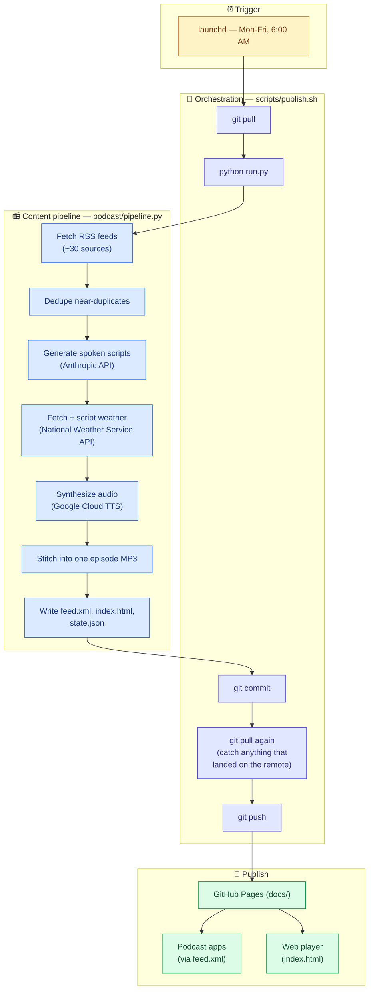

# Personalized News Podcast

A daily audio news briefing, generated automatically and published as a
real RSS podcast feed. **Status: live and running** — publishes itself
every weekday morning via a scheduled job on the author's Mac, no manual
steps required.

Subscribe by pasting the feed URL directly into any podcast app (Pocket
Casts, Apple Podcasts, Overcast, etc.):

```
https://ellewiz.github.io/personalized-news-podcast/feed.xml
```

For anyone who doesn't want to deal with a podcast app, there's also a
plain web player with no app or account required — just open the link and
press play:

```
https://ellewiz.github.io/personalized-news-podcast/
```

## What it actually does

Every weekday morning, without anyone touching a keyboard:

1. Pulls fresh items from a set of RSS feeds (general news, plus Markets,
   Tech & AI, Soccer/World Cup, NFL, NWSL, and WNBA)
2. Dedupes near-identical coverage of the same story
3. Writes a spoken script per segment via the Anthropic API
4. Synthesizes each segment as audio via Google Cloud Text-to-Speech, with
   a different voice per category
5. Stitches the segments into one MP3, with a short pause between each
6. Publishes the new episode + updated RSS feed to GitHub Pages
7. Commits and pushes the result back to this repo

## Content structure

Two tiers per episode:

### Tier 1 — Brief awareness (target: well under a minute)

- Pulled from nine general-news feeds (PBS NewsHour, UPI Top News, BBC
  World News, NBC News, Vox World, France 24, Radio Free Europe/Radio
  Liberty, ProPublica, The Atlantic Politics — see
  [`feeds.yaml`](./feeds.yaml))
- A handful of sentences covering the top headlines
- Goal: "aware, not drowning" — never stacks multiple articles about the
  same single story

### Tier 2 — Deep dive (the bulk of the episode)

Segment order, straight after Tier 1: **Markets**, **Tech & AI**, then all
sports grouped together — **Soccer/World Cup, NFL, NWSL, WNBA**.

- Each category pulls from its own feed(s) (see [`feeds.yaml`](./feeds.yaml))
- Depth scales with how much actually happened — a quiet window for a
  given category gets a one-line mention instead of padded filler, so
  episode length flexes naturally rather than targeting a fixed runtime
  (episodes so far have run anywhere from ~2 to ~8 minutes)
- **Markets is the one exception**: capped at the 2-3 biggest stories
  regardless of volume, rather than scaling with how much happened (see
  `CATEGORY_PREFERENCES` in `podcast/pipeline.py`)
- **NFL** is steered toward Philadelphia Eagles headlines specifically and
  told to skip betting lines/odds entirely — same mechanism, different
  category (also in `CATEGORY_PREFERENCES`)
- Single narrator throughout (no two-host conversational format), but each
  category has its own distinct voice

### Weather — closing sign-off

Local TV newscast convention: weather comes last, after the sports. Pulls
today's forecast from the **National Weather Service API**
(`api.weather.gov`) — free, no signup, no API key, official U.S.
government data — for Skillman, NJ 08558 by default (configurable via
`WEATHER_LAT`/`WEATHER_LON`/`WEATHER_LOCATION_LABEL` in `.env`). If the
weather API is unavailable, the segment is skipped rather than failing the
whole episode.

## How it works



## Architecture

```
feeds.yaml                RSS sources per tier/category
config/voices.yaml         Google Cloud TTS voice per tier/category
podcast/
  config.py                env vars + config file loading
  models.py                 FeedItem / ScriptSegment dataclasses
  fetch.py                   pull + recency-filter each feed
  dedupe.py                   collapse near-duplicate stories (title similarity)
  script.py                    build spoken scripts via the Anthropic API
  pronunciation.py               word -> spoken-alias / spell-out overrides for TTS
  weather.py                      National Weather Service API (closing segment)
  tts.py                          Google Cloud TTS synthesis + plain-byte MP3
                                   concatenation (see "Why not ffmpeg" below)
  rss_feed.py                    rebuild docs/feed.xml from state/state.json
  web_player.py                   rebuild docs/index.html, a no-app-required player
  pipeline.py                     orchestrates the full run, with progress logging
run.py                      entrypoint: `python run.py`
scripts/publish.sh           run pipeline, then git add/commit/push docs + state
launchd/                     macOS scheduled-job definition (Mon-Fri, 6am)
state/state.json             seen item guids + published episode metadata
docs/                        GitHub Pages root: feed.xml + episodes/*.mp3
                              (each episode also gets a *-script.txt transcript,
                              not published prominently but kept in the repo)
```

## Setup (from scratch on a new machine)

1. `python3 -m venv .venv && source .venv/bin/activate && pip install -r requirements.txt`
2. Copy `.env.example` to `.env` and fill in:
   - `ANTHROPIC_API_KEY` — https://console.anthropic.com/settings/keys
     (requires prepaid credits, no free tier; a few dollars covers a long
     time at this usage level)
   - `GOOGLE_TTS_API_KEY` — Google Cloud Console → enable "Cloud
     Text-to-Speech API" → Credentials → **+ Create credentials → API
     key** (not the service-account wizard). Free up to 1M characters/month.
   - `PODCAST_BASE_URL` — the GitHub Pages URL this repo will be served
     from, e.g. `https://<you>.github.io/<repo>`
3. `config/voices.yaml` already has a distinct Google Neural2 voice
   assigned per tier/category — swap any of them for a different one from
   the [voice list](https://cloud.google.com/text-to-speech/docs/voices)
   if you want a different sound.
4. In GitHub repo settings → **Pages** → Source: Deploy from a branch →
   branch `main`, folder `/docs` → Save.

## Running manually

```
source .venv/bin/activate
set -a && source .env && set +a
python run.py
```

Prints progress as it goes (fetching → scripts → TTS → stitching →
publishing). Writes `docs/episodes/<date>.mp3` and rebuilds
`docs/feed.xml`, but does **not** commit or push — that's what
`scripts/publish.sh` is for.

## Automation (the actual Mon-Fri schedule)

Runs via `launchd` on macOS — the plist is checked into
[`launchd/com.ellewiz.personalized-news-podcast.plist`](./launchd/com.ellewiz.personalized-news-podcast.plist),
fires weekdays at 6:00 AM.

**Install on a Mac:**
```
mkdir -p logs
cp launchd/com.ellewiz.personalized-news-podcast.plist ~/Library/LaunchAgents/
launchctl bootstrap gui/$(id -u) ~/Library/LaunchAgents/com.ellewiz.personalized-news-podcast.plist
```

**Test-fire it immediately** (don't wait for 6am to check it works):
```
launchctl start com.ellewiz.personalized-news-podcast
cat logs/publish.log
cat logs/publish.error.log
```

**Requirements for unattended runs to actually succeed:**
- The Mac needs to be awake at 6am, or it runs whenever it next wakes.
  System Settings → Battery → Power Adapter → enable "Prevent automatic
  sleeping when the display is off" — the display can still turn off on
  its own schedule, the system just stays awake underneath it.
- The first `git push` will trigger a macOS keychain prompt for
  `git-credential-osxkeychain` — click **Always Allow**, not just Allow,
  or every future unattended run will hang waiting on a prompt nobody's
  there to click.

**To change the schedule:** edit the `Hour`/`Minute`/`Weekday` values in
the plist, then re-run the `bootout` + `bootstrap` commands below to
reload it:
```
launchctl bootout gui/$(id -u)/com.ellewiz.personalized-news-podcast
launchctl bootstrap gui/$(id -u) ~/Library/LaunchAgents/com.ellewiz.personalized-news-podcast.plist
```

## Design notes and lessons learned

**Why not ffmpeg for stitching segments together.** The original design
used `ffmpeg` via `subprocess` to concatenate segment MP3s. On the actual
deployment machine (Apple Silicon Mac, macOS 26), this reliably segfaulted
— first the whole Python interpreter, then just the ffmpeg child process,
across multiple different ffmpeg invocations. Root cause: macOS's Network
and media frameworks are unsafe to use after `fork()` in a process that's
already made HTTPS calls on other threads (which this process always has,
via the Anthropic and Google TTS API calls) — a documented class of bug,
not specific to this pipeline. Rather than keep patching around it, the
fix was to drop ffmpeg entirely: Google Cloud TTS returns each segment as
a plain MP3 frame stream with no container-level metadata, so raw byte
concatenation of the files (`tts.concatenate_mp3s`) plays back correctly
with no subprocess involved. One less dependency, and no crash surface.

**Why Google Cloud TTS over ElevenLabs.** ElevenLabs sounds noticeably
more natural, but costs money from the first minute of real use. Google's
Neural2 voices are free up to 1M characters/month — comfortably covers a
five-day-a-week cadence at this episode length — at the cost of
occasionally awkward sentence breaks. If voice quality becomes the
limiting factor, swapping providers is a contained change (`tts.py` +
`config/voices.yaml` only — see git history for the ElevenLabs → Google
swap as a template for doing it the other direction).

**`dedupe.py`** uses a simple title-similarity heuristic (`difflib`, no
LLM call) to collapse near-duplicate stories. Intentionally simple; may
need tuning if it turns out to be too aggressive or not aggressive enough
in practice.

**Mispronounced words.** Google's TTS gets some words wrong (e.g. read
"Kyiv" as "Keev" — technically correct, but unrecognizable out of
context). Fix: add an entry to the `PRONUNCIATIONS` dict in
`podcast/pronunciation.py` — `"Kyiv": "Kee-ev"` means "whenever this word
appears, say it like this instead." For acronyms that get read as a word
instead of spelled out (e.g. "AI" read as "eye"), add the bare word to
the `SPELL_OUT` set instead — that uses SSML's character-by-character
mode rather than a text substitution. No other changes needed either way.

**Broadcast-time grounding.** Early episodes sometimes parroted a source
article's own time-of-day language ("this morning," "good evening")
verbatim, or blurred together events from different time zones (e.g.
implying an Asian market session was concurrent with a US session that
hadn't opened yet) — because the script prompts had no idea what time the
episode was actually being generated for. Fixed by computing the actual
broadcast time (Eastern, DST-aware) once per run in `pipeline.py` and
passing it into every Tier 1/Tier 2 prompt, with explicit rules against
copying stale time framing or inventing greetings. The Markets category
also got an explicit instruction to call out which market session an item
refers to, since it airs before the US market even opens.

**Script transcripts.** Every run writes
`docs/episodes/<date>-script.txt` — the full generated text for every
segment, plus the broadcast time used. Generated audio has no easy way to
go back and check "what did it actually say," so this exists purely so a
listener-reported issue (a factual mix-up, confusing phrasing, whatever)
can be traced to the actual text instead of being unrecoverable once the
audio's already made. This is exactly what caught the mid-word truncation
bug below on its first real occurrence.

**Mid-sentence truncation on busy Tier 2 segments.** Tier 1 has an
explicit word-count target; Tier 2 deliberately doesn't (it's told to
"cover it properly" when there's a lot of news). `_generate()`'s
`max_tokens=1024` was too tight for that — on a busy day, several Tier 2
segments hit the cap and got cut off mid-word, and Tech & AI came back
completely empty. Fixed by raising the cap to 2048, trimming back to the
last complete sentence if the cap is still hit (rather than shipping
dangling audio), and retrying once on a genuinely empty response before
falling back to a placeholder. Loosening the Tier 1 length *guideline*
wouldn't have touched this — the segment that actually has a length limit
finished cleanly; the ones with no limit hit an invisible technical one.

**`state/state.json`** is the source of truth for both "already seen"
item guids (so the same story doesn't get covered twice) and the full
episode list used to rebuild `feed.xml` from scratch on every run. It's
committed to the repo (via `scripts/publish.sh`) so state persists across
runs without a separate database.

## Feeds and voices

- All RSS sources: [`feeds.yaml`](./feeds.yaml)
- All voice assignments: [`config/voices.yaml`](./config/voices.yaml)

NWSL and WNBA each now have a dedicated feed (The Equalizer, and The Next, along with ESPN WNBA respectively) alongside the two shared general women's-sports sources (Just Women's Sports, The Gist).

## Possible next steps

- Tune `dedupe.py`'s similarity threshold based on real episodes
- Revisit ElevenLabs if Google's sentence-break quality becomes annoying
- **v2**: Skip publishing on NYSE holidays (work's actual closure calendar),
  using the [`holidays`](https://pypi.org/project/holidays/) package
  instead of a plain Mon-Fri check in the launchd schedule
- Local politics category (feeds TBD — user is strong on national news,
  wants better local coverage for their area)
- **Storage ceiling** (flagged by a friend who saw the repo): GitHub
  Pages soft-caps published sites at 1GB. Today's episode alone is
  ~7.7MB, and `.git` is already 20MB after just a few days — at that
  rate this repo has a runway of roughly 6 months before hitting the
  cap, not urgent tonight but real. Two separable problems: (1) what's
  *served* (fixable by pruning old episodes from `docs/episodes/` +
  `feed.xml` going forward — nobody's relistening to a random Tuesday
  from 3 months back anyway), and (2) `.git` history itself growing
  forever even after files are deleted, since old commits still
  reference every blob ever committed (git doesn't actually forget
  until history is rewritten). Worth a real look at Git LFS or hosting
  episode audio outside git entirely (e.g. object storage) before this
  becomes a real problem rather than after.
- **Local/free TTS**: a friend pointed at
  [OHF-Voice/piper1-gpl](https://github.com/OHF-Voice/piper1-gpl) —
  runs locally, no API key, no per-character cost at all (vs. Google's
  free-tier-then-metered model). Worth a quality comparison against
  Google's Neural2 voices if TTS cost or the network dependency ever
  becomes a real concern.
